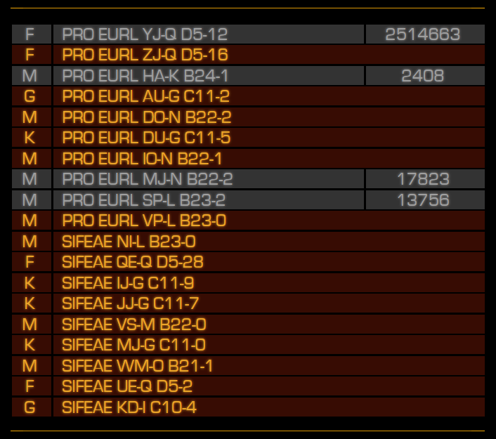

# Elite Dangerous Scout

Greetings commander and welcome to EDScout; an Elite Dangerous companion app to simplify finding unexplored worlds.

I got sick of jumping into system after system trying to find unexplored worlds to put my name to only to be disappointed because someone had already explored it. This tool is intended to help improve your odds of finding new and interesting systems and worlds to explore.

Note that many systems out are discovered by commanders who weren't running EDDiscovery / EDSM. Consequently it's not a foolproof guarantee that the system you're about to leap into is definitely new, but it certainly improves the chances. Conversely, if you're looking for guarantees that a system you're jumping to will make some money, this can quickly show you some profitable route options (along the lines of the road to riches).

## Usage
 
1. Run `EDScout.exe`
2. Plot a new route in Galaxy Map. Each time you do, you should be greeted with a list of systems and ain indication of how much they're worth to scan (if they're known) or what to investigate if you want to try something new.

## Key

* Grey rows indicate explored systems
* Coloured lines indicate systems that (according to EDSM) have not been mapped.
* Main star types for each system are listed in the first column.
* Mapped value of systems (for those that have already been discovered) are displayed in the right-most column. 

## Version History

### 1.0.0 - Initial release

* Written in Python.
* Basic GUI  is operational using a combination of Flask, ZMQ and SocketIO.
* Watches `C:\Users\<USER>\Saved Games\Frontier Developments\Elite Dangerous\NavRoute.json` for changes then queries EDSM for all the systems in the route to check their value.
* Packaged up using PyInstaller. 